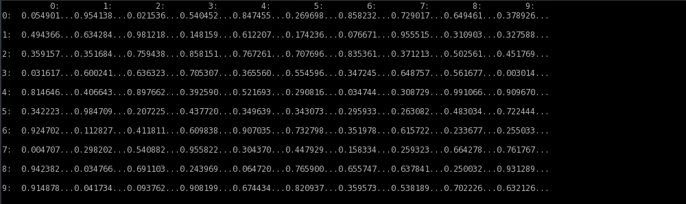
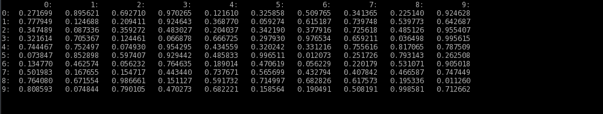
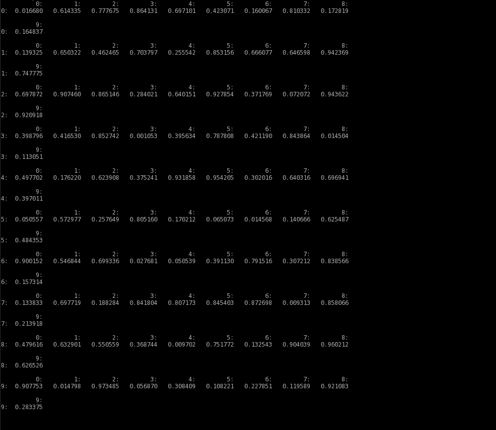
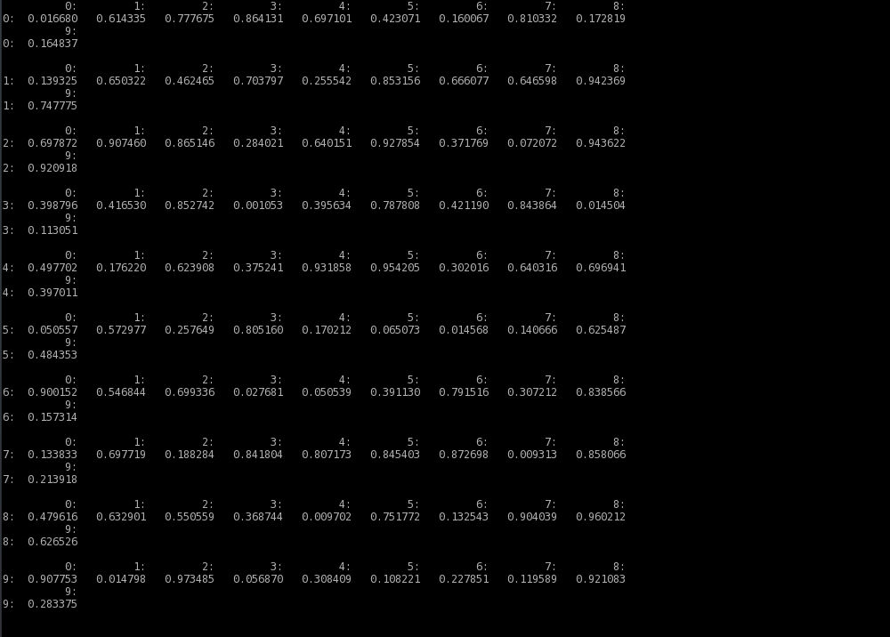

.. melancholia documentation master file, created by
   sphinx-quickstart on Fri Feb 13 13:00:36 2015.
   You can adapt this file completely to your liking, but it should at least
   contain the root `toctree` directive.

Welcome to melancholia's documentation!
=======================================
**'melancholia' - print a Numpy array to a file or a variable in a human-readable way.**

.. contents:: :local:

About 'melancholia'
------------------------------------------------------------------
'melancholia' is a Python module which can be used to write a Numpy array in a format which is easy to read by humans.
An array may be printed into a string variable or into a file.

'melancholia' checks the number of dimensions in an array and act acordignly -
if an array is one dimensional, it is printed as a vector,
if an array is two dimensional, it is printed as a matrix.
In the latter, the first dimension of array are rows, the second diemension are columns.

'melancholia' takes care of:

#) printing indices of vector entries, or matrix rows and columns

#) printing entries of an array in a requested format

#) addiing none or extra lines between the printed lines

#) line wrapping, if needed

#) printing delimiters between entries (default or custom)

#) printing array names and dimensions (if requested)

.. note::

    In the current version (v1.0) 'melancholia' supports 1-dimensional and 2-dimensional Numpy arrays. 1 dimensional arrays can be printed vertically or horizontally.

.. warning::

    In the current version (v1.0) 'melancholia' does not support complex numbers.

Download and Install
------------------------------------------------------------------

melancholia's sources are availalble to download from `GitHub <http://github.com/JacekPierzchlewski/melancholia/>`_.
To install 'melancholia' on your computer type:

:code:`$ python setup.py install`

in the root directory of the melancholia's source tree.

License
------------------------------------------------------------------
'melancholia' is a (very) free software, it is licensed under BSD 2-clause license.

Author
------------------------------------------------------------------
'melancholia' was created and is maintained by Jacek Pierzchlewski (jap _at_ es dot aau dot dk) from Aalborg University. |br|
'melancholia' is small side project to 'IRfDUCS' research project `www.irfducs.org <http://www.irfducs.org>`_.

Writing an array to a string variable
------------------------------------------------------------------

Function **printA** which is implemented in 'melancholia', is able to write a Numpy array to a string variable.
Below there is a list of examples of using the function.
There are more examples in files **example_1Darray.py** and **example_2Darray.py** which can be found in **examples/** directory.
The first file contains examples of printing 1-dimensional arrays, the latter contains examples of printing 2-dimensional arrays.

.. warning::

    Examples below use optional arguments to the **printA** function. ALL of the optional arguments to the **printA** function can be mixed.

The simplest usage
^^^^^^^^^^^^^^^^^^^^^^^^^^^^^^^^^^^^^^^^^^^^^^^^^^^^^^^^^^^^^^^^^^

The simplest usage of **printA** function is in the example below.
A 2-dimensional array is passed to the function as a sole argument:

.. code-block:: python
   :emphasize-lines: 2

    mA = np.random.rand(10, 10)
    strA = melancholia.printA(mA)
    print(strA)

which gives an output like:

Custom delimiter
^^^^^^^^^^^^^^^^^^^^^^^^^^^^^^^^^^^^^^^^^^^^^^^^^^^^^^^^^^^^^^^^^^
It is possible to add a custom delimiter between entries of an array. Function argument 'strDelimiter' is used to define a delimiter:

.. code-block:: python
   :emphasize-lines: 2

    mA = np.random.rand(10, 10)
    strA = melancholia.printA(mA, strDelimiter='...')
    print(strA)

The requested delimiter can be seen in the output:

Horizontal printing of a 1D array
^^^^^^^^^^^^^^^^^^^^^^^^^^^^^^^^^^^^^^^^^^^^^^^^^^^^^^^^^^^^^^^^^^
Numpy array with only one dimension is by default printed vertically:

.. code-block:: python
   :emphasize-lines: 2

    vA = np.random.rand(10)
    strA = melancholia.printA(mA)
    print(strA)

the result is:

Function argument 'bVert1D' switches on/off vertical printing of a 1D array.
To print a matrix horizontally, the argument must be zeroed:

.. code-block:: python
   :emphasize-lines: 2

    vA = np.random.rand(10)
    strA = melancholia.printA(mA, bVert1D=0)
    print(strA)

The array is now printed horizontally:

No separation between rows of a 2D array
^^^^^^^^^^^^^^^^^^^^^^^^^^^^^^^^^^^^^^^^^^^^^^^^^^^^^^^^^^^^^^^^^^
By default, there is always one line separation between rows of a 2D array. Function argument 'iRowSpaces' regulates the number of empty lines printed between the rows.
To print an array in a more compressed way, without any rows separation, the argument must be zeroed:

.. code-block:: python
   :emphasize-lines: 2

    mA = np.random.rand(10, 10)
    strA = melancholia.printA(mA, iRowSpaces=0)
    print(strA)

which gives an output like:

Custom format of entries
^^^^^^^^^^^^^^^^^^^^^^^^^^^^^^^^^^^^^^^^^^^^^^^^^^^^^^^^^^^^^^^^^^
By default, the custom format of entries is '%.6f'. Function argument 'strFormat' regulates the format of entries. Allowed formats are '%d' (integer numbers), %.1f, %.2f, %.3f...etc.
In the example below the entries are printed as integers:

.. code-block:: python
   :emphasize-lines: 2

    mA = np.random.randint(-10,10(10, 10))
    strA = melancholia.printA(mA, strFormat='%d')
    print(strA)

which gives an output like:

Array header
^^^^^^^^^^^^^^^^^^^^^^^^^^^^^^^^^^^^^^^^^^^^^^^^^^^^^^^^^^^^^^^^^^
It is possible to add a header before an array is printed.
Header contains information about the number of dimensions of an array, its shape and the type of entries.
Function argument 'bPrintHeader' adds a header:

.. code-block:: python
   :emphasize-lines: 2

    mA = np.random.rand(10, 10)
    strA = melancholia.printA(mA, bPrintHeader=1)
    print(strA)

now there is a header added before an array:

.. image:: images/printA_header.png

Array name in a header
^^^^^^^^^^^^^^^^^^^^^^^^^^^^^^^^^^^^^^^^^^^^^^^^^^^^^^^^^^^^^^^^^^
Function argument 'strArrayName' is used to add an array name to the header of an array:

.. code-block:: python
   :emphasize-lines: 2

    mA = np.random.rand(10, 10)
    strA = melancholia.printA(mA, strArrayName='mA', bPrintHeader=1)
    print(strA)

the array name is added to the header:

Wrap lines after x characters
^^^^^^^^^^^^^^^^^^^^^^^^^^^^^^^^^^^^^^^^^^^^^^^^^^^^^^^^^^^^^^^^^^
If a 2D array, or a 1D array printed horizontally, has many entries in a single row, it may be needed to wrap lines with the entries.
By deafult, the line is wrapped after 4096 characters. This may be regulated using 'iMaxCols' argument. In the example below the lines
are wrapped NOT LATER then after printing 89 characters. Note: new line '\\n' is treated as a character.

.. code-block:: python
   :emphasize-lines: 2

    mA = np.random.rand(10, 10)
    strA = melancholia.printA(mA, iMaxCols=89)
    print(strA)

the lines are now wrapped:

Wrap lines after x entries
^^^^^^^^^^^^^^^^^^^^^^^^^^^^^^^^^^^^^^^^^^^^^^^^^^^^^^^^^^^^^^^^^^
With argument 'iMaxEntr' it is possible to regulate line wrapping so that the lines are wrapped after given number of printed entries:

.. code-block:: python
   :emphasize-lines: 2

    mA = np.random.rand(10, 10)
    strA = melancholia.printA(mA, iMaxEntr=9)
    print(strA)

the lines are now wrapped after 9 printed entries:

No separation between the wrapped lines
^^^^^^^^^^^^^^^^^^^^^^^^^^^^^^^^^^^^^^^^^^^^^^^^^^^^^^^^^^^^^^^^^^
If an array is printed with line wrapping, by default there is one line separation between wrapped lines.
Argument 'iLineSpaces' is able to regulate the spacing between the lines.
To remove any separation between the wrapped lines, the argument 'iLineSpaces' must be zeroed:

.. code-block:: python
   :emphasize-lines: 2

    mA = np.random.rand(10, 10)
    strA = melancholia.printA(mA, iMaxEntr=9, iLineSpaces=0)
    print(strA)

the lines are now wrapped without any line separation:

Writing an array to a file
------------------------------------------------------------------
Function **dumpA** which is implemented in 'melancholia', is able to write a Numpy array to a string variable.
It takes two required arguments: an array to be printed to a file and a filename.
The function is in fact an overlay to the **printA** function, hence
all of the arguments which can be used with **printA** function (described above) work with **dumpA** function.
An example below writes an array to a *array.txt* file:

.. code-block:: python
   :emphasize-lines: 2

    mA = np.random.rand(10, 10)
    melancholia.dumpA(mA, strFile='array.txt')

File mode
^^^^^^^^^^^^^^^^^^^^^^^^^^^^^^^^^^^^^^^^^^^^^^^^^^^^^^^^^^^^^^^^^^

By deafult the file is opened with mode 'w' (write). Argument 'strMode' can be used to open a file in the 'a' (append) mode:

.. code-block:: python
   :emphasize-lines: 2

    mA = np.random.rand(10, 10)
    melancholia.dumpA(mA, strFile='array.txt', strMode='a')

In the 'a' (append) mode array is added to the end of file, while in the 'w' write mode, a new file is created.

.. warning::

    In the write mode, an existing file of a given name will be deleted and overwritten.

Indices and tables
==================

* :ref:`genindex`
* :ref:`modindex`
* :ref:`search`

.. |br| raw:: html

    

